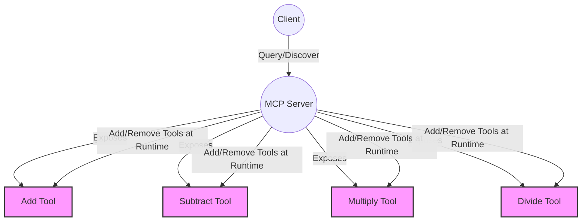

# Live Tools for AI: Dynamic LLM Servers with Model Context Protocol (MCP)

## Prerequisites

- Node.js (v18 or later)
- pnpm (or npm/yarn)
- TypeScript



> **What you'll build:**
> A calculator server that can add, subtract, multiply, and divide — and you can add new tools _while it's running_. No restart needed. You'll see how to test each tool as you go, and learn best practices for dynamic tool loading with MCP.

This hands-on guide shows you how to build a dynamic tool server using MCP. You'll see how to add new capabilities live, and how clients can discover and use them instantly.

---

## Why Dynamic Tool Loading Matters

MCP enables tools to be added and removed at runtime, giving language models the power to discover and use new functionality instantly. This is particularly valuable for systems where capabilities evolve rapidly — for example, multi-agent frameworks, modular applications, or tool-rich developer platforms.

---

## Step 1: Start Simple — A Single Tool

We begin with a minimalist calculator server exposing just one tool — addition:

```ts
import { FastMCP } from 'fastmcp';
import { z } from 'zod';
import { PORT } from './constants';

const server = new FastMCP({
  name: 'calculator-tools-server',
  version: '1.0.0',
  instructions: 'This is a calculator server.',
});

server.addTool({
  name: 'add',
  description: 'Add two numbers together',
  parameters: z.object({
    a: z.coerce.number().describe('The first number to add'),
    b: z.coerce.number().describe('The second number to add'),
  }),
  annotations: {
    openWorldHint: false,
    readOnlyHint: true,
    title: 'Number Addition Calculator',
  },
  execute: async (args) => {
    const result = args.a + args.b;
    return result.toString(); // MCP tools return strings for consistency
  },
});

server.start({
  transportType: 'httpStream',
  httpStream: { port: PORT },
});
```

**Test it:**
Try a query:
`What is 2 plus 3?`
You should get: `5`

> **Why this works:**
> MCP tools are defined with clear schemas, so clients know exactly how to use them. You can view this tool in the MCP Inspector for a visual overview.

---

## Step 2: Live Demo — Adding Tools Without Restarting

The core of this demo is adding tools live — without server restarts. Below are the additional tools we introduced, each uncommented progressively during the demo:

### Subtraction

```ts
server.addTool({
  name: 'subtract',
  description: 'Subtract two numbers',
  parameters: z.object({
    a: z.coerce.number().describe('The number to subtract from'),
    b: z.coerce.number().describe('The number to subtract'),
  }),
  annotations: { readOnlyHint: true },
  execute: async (args) => (args.a - args.b).toString(),
});
```

**Test it:**
`What is 50 minus 30?`
You should get: `20`

> **Why this works:**
> You can add new tools at runtime, and the server updates instantly. Clients can discover and use new tools without any redeploy.

### Multiplication

```ts
server.addTool({
  name: 'multiply',
  description: 'Multiply two numbers',
  parameters: z.object({
    a: z.coerce.number().describe('First number'),
    b: z.coerce.number().describe('Second number'),
  }),
  annotations: { readOnlyHint: true },
  execute: async (args) => (args.a * args.b).toString(),
});
```

**Test it:**
`What is 8 multiplied by 6?`
You should get: `48`

> **Why this works:**
> Each tool is self-contained and schema-validated. The server can expose as many tools as you need, and each is instantly available to clients.

### Division with Error Handling

```ts
server.addTool({
  name: 'divide',
  description: 'Divide first number by second number',
  parameters: z.object({
    a: z.coerce.number().describe('Dividend'),
    b: z.coerce.number().describe('Divisor'),
  }),
  annotations: { readOnlyHint: true },
  execute: async (args) => {
    if (args.b === 0) throw new Error('Cannot divide by zero');
    return (args.a / args.b).toString();
  },
});
```

**Test it:**
`What is 100 divided by 4?`
You should get: `25`

`What happens if I try to divide by zero?`
You should get: `Error: Cannot divide by zero`

> **Why this works:**
> Error handling is built into the tool definition, so invalid operations (like division by zero) are caught and reported cleanly.

---

## Step 3: Automatic Client Discovery

MCP clients can query the available tools at runtime, enabling LLMs to adapt without manual reconfiguration. Here's a simplified set of queries used to validate the tools:

```js
const queries = [
  'What is 25 plus 15?',
  'What is 50 minus 30?',
  'What is 8 multiplied by 6?',
  'What is 100 divided by 4?',
  'What happens if I try to divide by zero?',
  'Multiply 5 and 3, then add 10 to the result.',
];
```

Each query triggers the relevant tool, allowing the LLM client to show how its capabilities evolve as new tools become available.

> **Pro Tip:**
> After adding a new tool, always re-query the tool list from your client to ensure it's up to date.

---

## Common Pitfalls

- **Tool name collisions:** Adding a tool with an existing name will overwrite the previous one.
- **Error handling:** Always validate input (e.g., don't divide by zero).
- **Client sync:** Make sure your client re-queries the tool list after changes.
- **Schema mismatches:** If your tool's parameters don't match the schema, the server will reject the call.

---

## Key Takeaways

- You can add/remove tools at runtime — no server restart needed.
- Clients adapt instantly, making your AI system more flexible.
- MCP + FastMCP = rapid prototyping for tool-rich AI apps.
- Clear schemas and error handling make your tools robust and easy to use.

---

## Conclusion

The Model Context Protocol introduces a more dynamic way to serve tools to language models. This calculator demo is just the beginning. Imagine integrating weather APIs, file systems, search tools, or autonomous agents — all dynamically loaded as needed.

By embracing MCP's live capabilities, developers can build AI applications that adapt in real time, improve continuously, and stay relevant without costly redeployments.

**Next steps:**

- Try adding your own tool (e.g., a square root or power function)
- Integrate with a real LLM client and watch it discover new tools live
- Explore error handling and advanced schemas for more complex tools

> **Build, test, and extend — your AI server is now truly dynamic!**

---

## Troubleshooting

- **Port conflicts:** Ensure the server port is not already in use.
- **Schema errors:** Double-check your tool parameter schemas for accuracy.
- **Client synchronisation:** If new tools do not appear, re-query the tool list from your client.
- **Authorisation issues:** If you add authentication, ensure clients provide the correct credentials.
