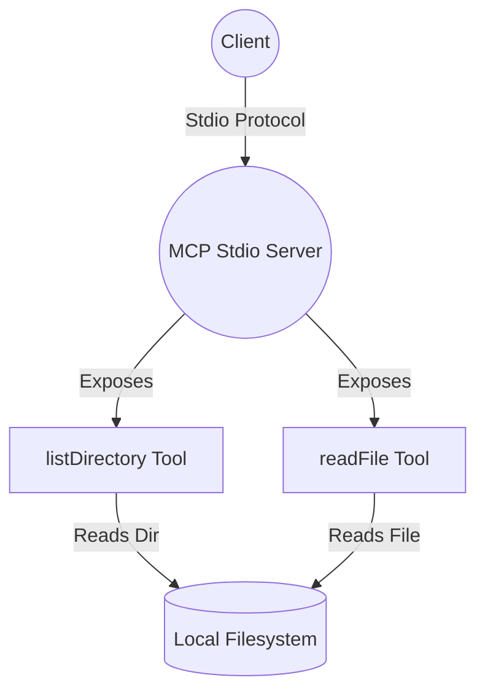

# Local Power: Using the Stdio Protocol for Filesystem Access with MCP

## Prerequisites

- Node.js (v18 or later)
- pnpm (or npm/yarn)
- TypeScript

---

## Setup

1. **Clone the repository or create a new project directory.**
2. **Install dependencies:**
   ```sh
   pnpm install
   # or
   npm install
   # or
   yarn install
   ```
3. **Project structure:**
   - Place your server code in `src/02-stdio-filesystem/server.ts`
   - Place your client code in `src/02-stdio-filesystem/client.ts`
   - Ensure you have a `model.ts` in the appropriate location (see client example)

---

## How the Stdio Protocol Works

The stdio protocol enables two processes (a client and a server) to communicate using their standard input and output streams. In this setup:

- The MCP server runs as a local process and listens for requests via its stdin, responding via stdout.
- The client launches the server as a subprocess and sends requests over stdio, receiving responses in turn.
- This direct communication allows the server to access local resources (like the filesystem) that are unavailable to remote web servers.

**Why use stdio?**

- No network setup required—communication is local and secure to your machine.
- Enables powerful local tools for AI workflows, such as file access, system info, and more.

---



> **What you'll build:**
> A local MCP server that exposes your filesystem as tools—list directories, read files, and more—using the `stdio` protocol. You'll see how stdio enables access to local resources that a web server _can't_ reach, and how to test these tools step by step.

This hands-on guide shows you how to use the Model Context Protocol (MCP) with the `stdio` transport, unlocking local capabilities for your AI tools.

---

## Why the Stdio Protocol?

Most web servers are sandboxed—they can't see your local files or interact with your machine's real environment. The `stdio` protocol, by contrast, runs the server as a local process, giving it direct access to your filesystem and other local resources.

**Key point:**

> Use `stdio` when you want your AI tools to interact with files, directories, or anything else on your local machine—something a remote web server can't do.

---

## Step 1: The Filesystem Server

Here's a minimal MCP server that exposes two tools:

- `listDirectory`: List the contents of any directory
- `readFile`: Read the contents of any file

```ts
import { FastMCP } from 'fastmcp';
import { z } from 'zod';
import fs from 'fs/promises';
import path from 'path';

const server = new FastMCP({ name: 'FileSystem', version: '1.0.0' });

// Tool: List directory contents
server.addTool({
  name: 'listDirectory',
  description: 'List contents of a directory',
  parameters: z.object({ path: z.string().describe('Directory path to list') }),
  annotations: { readOnlyHint: true },
  execute: async (args) => {
    try {
      const dirPath = path.resolve(args.path);
      const items = await fs.readdir(dirPath, { withFileTypes: true });
      return JSON.stringify(
        items.map((item) => ({
          name: item.name,
          type: item.isDirectory() ? 'directory' : 'file',
          path: path.join(dirPath, item.name),
        })),
        null,
        2,
      );
    } catch (error) {
      return `Error listing directory: ${error instanceof Error ? error.message : 'Unknown error'}`;
    }
  },
});

// Tool: Read file contents
server.addTool({
  name: 'readFile',
  description: 'Read contents of a file',
  parameters: z.object({ path: z.string().describe('File path to read') }),
  annotations: { readOnlyHint: true },
  execute: async (args) => {
    try {
      const filePath = path.resolve(args.path);
      return await fs.readFile(filePath, 'utf-8');
    } catch (error) {
      return `Error reading file: ${error instanceof Error ? error.message : 'Unknown error'}`;
    }
  },
});

// Start server with stdio transport
server.start({ transportType: 'stdio' });
console.log('File System MCP Server started with stdio transport');
```

**Test it:**
Start the server using the provided script or with `pnpm example:server:02`.
Try listing your home directory or reading a file you know exists.

> **Why this works:**
> The server runs as a local process, so it can access any file or directory your user account can. This is impossible for a remote web server due to security restrictions.

---

## Step 2: The Stdio Client

The client launches the server as a subprocess and connects via stdio, then discovers and uses the tools.

```ts
// src/02-stdio-filesystem/client.ts
import {
  experimental_createMCPClient as createMCPClient,
  generateText,
} from 'ai';
import { StdioClientTransport } from '@modelcontextprotocol/sdk/client/stdio';
import { model } from '../model'; // Make sure this file exports your model config

async function main() {
  const mcpClient = await createMCPClient({
    transport: new StdioClientTransport({
      command: 'npx',
      args: ['tsx', 'src/02-stdio-filesystem/server.ts'],
    }),
  });

  const tools = await mcpClient.tools();
  console.dir(tools, { depth: null });

  const result = await generateText({
    model,
    tools,
    prompt: `\nPlease summarize the contents of the directory '/Users/jreehal/dev/ai/typescript-mcp-workshop'`,
    maxSteps: 15,
  });

  await mcpClient.close();

  console.log('\n=== Demo Results ===');
  console.log(result.text);
}

main().catch((err) => {
  console.error(err);
  process.exit(1);
});
```

**Test it:**
Run the client with `pnpm example:client:02` or directly with `pnpm tsx src/02-stdio-filesystem/client.ts`.
You should see a summary of your project directory, generated by the AI using the local tools.

> **Why this works:**
> The client can access _real_ local files and directories, not just remote data. This is only possible because the server is running with stdio on your machine.

---

## Common Pitfalls & Troubleshooting

- **Permissions:** The server can only access files your user account can read.
- **Path errors:** Always use absolute or carefully resolved paths to avoid confusion.
- **Security:** Do not expose stdio servers to untrusted code—they have full local access.
- **Authorisation:** If you add authentication, ensure clients provide the correct credentials.

---

## Key Takeaways

- The `stdio` protocol lets your AI tools interact with your local environment.
- Use it for anything that needs real filesystem or OS access.
- MCP makes it easy to expose local tools to your AI workflows.

---

## Conclusion

The stdio protocol is your bridge to local power—use it to unlock capabilities that web servers can't provide. Try extending the server with new tools (e.g., write files, get system info), and see how your AI can become a true local assistant!

> **Build, test, and extend—your AI tools now have local superpowers!**
