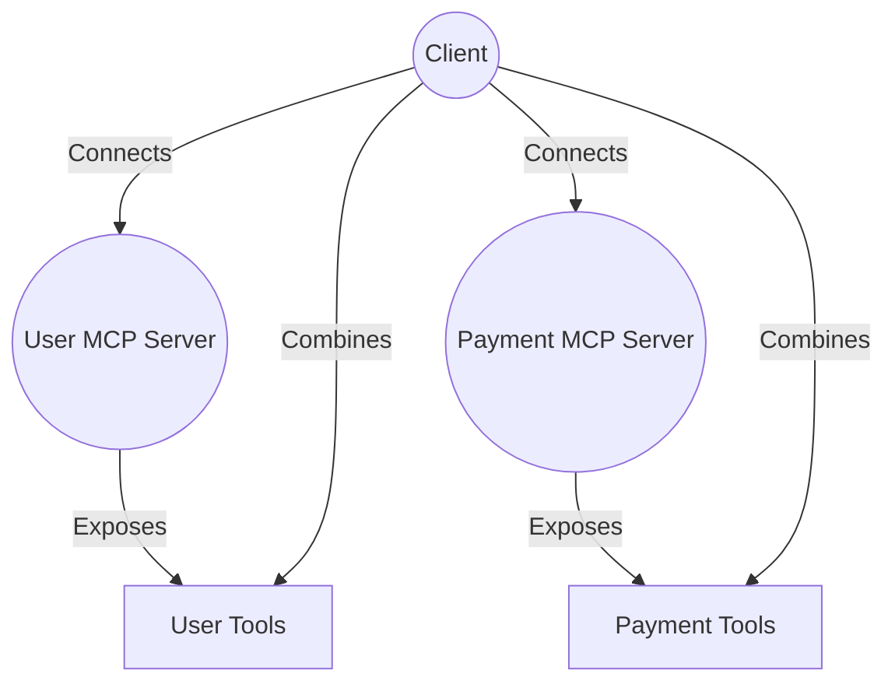

# Composable AI: Multi-Server Patterns with MCP

## Prerequisites

- Node.js (v18 or later)
- pnpm (or npm/yarn)
- TypeScript



> **What you'll build:**
> Two independent MCP servers—one for user data, one for payment transactions—and a client that combines their tools. You'll see how an LLM can use data from one server (e.g., user info) and combine it with another (e.g., payment history), unlocking powerful, modular workflows.

This hands-on guide shows you how to use the Model Context Protocol (MCP) to compose multiple servers, each with their own tools, and orchestrate them together with an LLM.

---

## Why Multi-Server MCP?

In real-world systems, data and functionality are often split across services: user management, payments, analytics, etc. MCP lets you expose each as a separate server, then combine their tools at the client or LLM layer.

**Key point:**

> With MCP, you can scale, secure, and evolve each service independently—while letting your AI combine and reason across all of them.

**Advantages:**

- **Modularity:** Each server is focused and easy to maintain.
- **Separation of concerns:** User and payment logic are isolated.
- **Composability:** The LLM can chain tools from different servers in a single workflow.
- **Scalability:** Add more servers (e.g., analytics, notifications) as your needs grow.
- **Real-world fit:** Mirrors how modern microservices and APIs are built.

---

## Step 1: The User Server

This server exposes user data and lookup tools.

```ts
import { FastMCP } from 'fastmcp';
import { z } from 'zod';
import { USER_SERVER_PORT } from './constants';

// Hardcoded user data
const users = [
  { id: 1, name: 'Bob', email: 'bob@example.com', balance: 1000 },
  { id: 2, name: 'Alice', email: 'alice@example.com', balance: 2000 },
  { id: 3, name: 'Charlie', email: 'charlie@example.com', balance: 500 },
];

const server = new FastMCP({
  name: 'user-server',
  version: '1.0.0',
  instructions:
    'This is a user management server that provides access to user data.',
});

// Tool: Get all users
server.addTool({
  name: 'getAllUsers',
  description: 'Get a list of all users',
  parameters: z.object({}),
  annotations: { readOnlyHint: true },
  execute: async () => JSON.stringify(users, null, 2),
});

// Tool: Get user by name
server.addTool({
  name: 'getUserByName',
  description: 'Get a user by their name',
  parameters: z.object({
    name: z.string().describe('The name of the user to find'),
  }),
  annotations: { readOnlyHint: true },
  execute: async (args) => {
    const user = users.find(
      (u) => u.name.toLowerCase() === args.name.toLowerCase(),
    );
    if (!user) throw new Error(`User ${args.name} not found`);
    return JSON.stringify(user, null, 2);
  },
});

server.start({
  transportType: 'httpStream',
  httpStream: { port: USER_SERVER_PORT },
});
console.log(`👥 User MCP Server running on port ${USER_SERVER_PORT}`);
```

**Test it:**
Start the user server with `pnpm example:user:03` or `pnpm example:server:03` (to start both servers).
Try calling the `getUserByName` tool for 'Bob'.

> **Why this works:**
> The user server is focused on user data only, making it easy to extend or secure without worrying about payment logic.

---

## Step 2: The Payment Server

This server exposes payment and transaction tools.

```ts
import { FastMCP } from 'fastmcp';
import { z } from 'zod';
import { PAYMENT_SERVER_PORT } from './constants';

// Hardcoded transaction data
const transactions = [
  { id: 1, from: 'Bob', to: 'Alice', amount: 100, date: '2024-03-15' },
  { id: 2, from: 'Alice', to: 'Charlie', amount: 50, date: '2024-03-16' },
  { id: 3, from: 'Bob', to: 'Charlie', amount: 75, date: '2024-03-17' },
  { id: 4, from: 'Charlie', to: 'Bob', amount: 25, date: '2024-03-18' },
  { id: 5, from: 'Bob', to: 'Alice', amount: 200, date: '2024-03-19' },
];

const server = new FastMCP({
  name: 'payment-server',
  version: '1.0.0',
  instructions:
    'This is a payment transaction server that manages user payment history.',
});

// Tool: Get all transactions
server.addTool({
  name: 'getAllTransactions',
  description: 'Get a list of all transactions',
  parameters: z.object({}),
  annotations: { readOnlyHint: true },
  execute: async () => JSON.stringify(transactions, null, 2),
});

// Tool: Get user transactions
server.addTool({
  name: 'getUserTransactions',
  description:
    'Get all transactions for a specific user (both sent and received)',
  parameters: z.object({
    name: z.string().describe('The name of the user to get transactions for'),
  }),
  annotations: { readOnlyHint: true },
  execute: async (args) => {
    const userTransactions = transactions.filter(
      (t) =>
        t.from.toLowerCase() === args.name.toLowerCase() ||
        t.to.toLowerCase() === args.name.toLowerCase(),
    );
    if (userTransactions.length === 0)
      throw new Error(`No transactions found for user ${args.name}`);
    return JSON.stringify(userTransactions, null, 2);
  },
});

// Tool: Get latest transactions
server.addTool({
  name: 'getLatestTransactions',
  description:
    'Get the latest transactions for a specific user (both sent and received)',
  parameters: z.object({
    name: z.string().describe('The name of the user to get transactions for'),
    limit: z
      .number()
      .optional()
      .default(3)
      .describe('Number of latest transactions to return'),
  }),
  annotations: { readOnlyHint: true },
  execute: async (args) => {
    const userTransactions = transactions
      .filter(
        (t) =>
          t.from.toLowerCase() === args.name.toLowerCase() ||
          t.to.toLowerCase() === args.name.toLowerCase(),
      )
      .sort((a, b) => new Date(b.date).getTime() - new Date(a.date).getTime())
      .slice(0, args.limit);
    if (userTransactions.length === 0)
      throw new Error(`No transactions found for user ${args.name}`);
    return JSON.stringify(userTransactions, null, 2);
  },
});

server.start({
  transportType: 'httpStream',
  httpStream: { port: PAYMENT_SERVER_PORT },
});
console.log(`💰 Payment MCP Server running on port ${PAYMENT_SERVER_PORT}`);
```

**Test it:**
Start the payment server with `pnpm example:payment:03` or `pnpm example:server:03` (to start both servers).
Try calling the `getLatestTransactions` tool for 'Bob'.

> **Why this works:**
> The payment server is focused on transaction data, and can be scaled or secured independently of user data.

---

## Step 3: The Multi-Server Client

The client connects to both servers, fetches their tools, and combines them for the LLM to use in a single workflow.

```ts
import {
  experimental_createMCPClient as createMCPClient,
  generateText,
} from 'ai';
import { StreamableHTTPClientTransport } from '@modelcontextprotocol/sdk/client/streamableHttp';
import { USER_SERVER_PORT, PAYMENT_SERVER_PORT } from './constants';
import { model } from '../model';

const userUrl = new URL(`http://localhost:${USER_SERVER_PORT}/stream`);
const userClient = await createMCPClient({
  transport: new StreamableHTTPClientTransport(userUrl),
});

const paymentUrl = new URL(`http://localhost:${PAYMENT_SERVER_PORT}/stream`);
const paymentClient = await createMCPClient({
  transport: new StreamableHTTPClientTransport(paymentUrl),
});

const userTools = await userClient.tools();
const paymentTools = await paymentClient.tools();

const allTools = { ...userTools, ...paymentTools };

const result = await generateText({
  model,
  tools: allTools,
  prompt: `
    Please help me get information about Bob's financial activity:

    1. First, get Bob's user information
    2. Then, get Bob's 3 most recent transactions
    3. Summarize the findings in a clear, organized way
  `,
  maxSteps: 30,
});

await userClient.close();
await paymentClient.close();

console.log('\n=== Demo Results ===');
console.log(result.text);
```

**Test it:**
Run the client with `pnpm example:client:03`.
You should see a summary that combines user and payment data for Bob, generated by the LLM using both servers' tools.

> **Why this works:**
> The client (and LLM) can orchestrate tools from multiple servers, using the output of one as input to another—just like a real-world workflow.

---

## Common Pitfalls

- **Port conflicts:** Make sure each server runs on a unique port.
- **Tool name collisions:** If two servers expose tools with the same name, the last one will overwrite the first in the combined toolset.
- **Error handling:** If a user or transaction is missing, the LLM should handle errors gracefully.
- **Network issues:** All servers must be running and reachable by the client.

---

## Key Takeaways

- MCP lets you compose multiple independent servers, each with their own tools.
- The LLM can chain and combine tools from different servers in a single workflow.
- This pattern mirrors real-world microservices and enables scalable, modular AI systems.
- You can add more servers (analytics, notifications, etc.) as your needs grow—no need to rebuild your whole stack.

---

## Conclusion

The multi-server pattern is a superpower for AI: it lets you build modular, composable, and scalable systems where each service can evolve independently. With MCP, your LLM can reason across all your data and tools, no matter where they live.

> **Build, test, and extend—your AI can now orchestrate across your whole stack!**

## Troubleshooting

- **Port conflicts:** Ensure each server runs on a unique port.
- **Tool name collisions:** If two servers expose tools with the same name, the last one will overwrite the first in the combined toolset.
- **Error handling:** If a user or transaction is missing, the LLM should handle errors gracefully.
- **Network issues:** All servers must be running and reachable by the client.
- **Authorisation:** If you add authentication, ensure clients provide the correct credentials.
