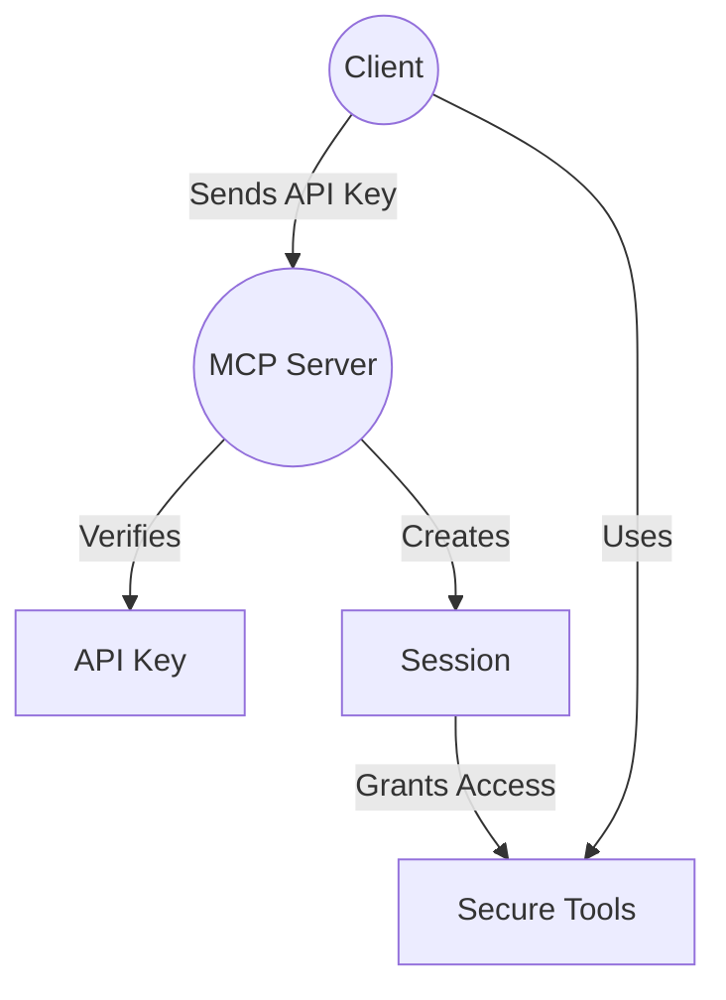

# Secure & Stateful: API Key Authorisation and Sessions with MCP

## Prerequisites

- Node.js (v18 or later)
- pnpm (or npm/yarn)
- TypeScript



> **What you'll build:**
> An MCP server that requires API key authentication, tracks user sessions, and exposes secure, personalized tools. You'll see how to protect sensitive data, enforce access control, and build stateful, auditable AI workflows.

This hands-on guide shows you how to use API keys and sessions in MCP to create secure, user-aware servers.

---

## Why Secure, Stateful MCP?

In real-world applications, you need to:

- Restrict access to sensitive tools and data
- Personalize responses based on the authenticated user
- Track and audit user actions (sessions)
- Prevent unauthorized or anonymous access

**Key point:**

> With API key auth and sessions, you can build secure, personalized, and auditable AI systems—just like modern SaaS APIs.

**Advantages:**

- **Security:** Only users with valid API keys can access tools.
- **Personalization:** Each session is tied to a user, so tools can return user-specific data.
- **Auditability:** Every action is associated with a session, enabling logging and compliance.
- **Stateful workflows:** Tools can use session data to maintain context across calls.

---

## Step 1: The Authenticated Server

This server requires an API key for every request, creates a session for each user, and exposes tools that use session data.

```ts
import { FastMCP } from 'fastmcp';
import { z } from 'zod';
import { BOB_API_KEY, ALICE_API_KEY, PORT } from './constants';

// Demo API keys
const DEMO_API_KEYS = [
  {
    id: '1',
    key: BOB_API_KEY,
    userId: 1,
    username: 'bob',
    role: 'customer',
    name: 'Bob Personal Key',
    created_at: '2024-01-01T00:00:00Z',
  },
  {
    id: '2',
    key: ALICE_API_KEY,
    userId: 3,
    username: 'alice',
    role: 'customer',
    name: 'Alice Personal Key',
    created_at: '2024-01-15T00:00:00Z',
  },
];

function verifyApiKey(apiKey) {
  const user = DEMO_API_KEYS.find((key) => key.key === apiKey);
  if (!user) return { valid: false, error: 'Invalid API key' };
  return { valid: true, user };
}

const transactions = [
  { id: 1, from: 'bob', to: 'alice', amount: 100, date: '2024-03-15' },
  { id: 3, from: 'bob', to: 'charlie', amount: 75, date: '2024-03-17' },
  { id: 5, from: 'bob', to: 'alice', amount: 200, date: '2024-03-19' },
  { id: 2, from: 'alice', to: 'charlie', amount: 50, date: '2024-03-16' },
  { id: 6, from: 'alice', to: 'bob', amount: 150, date: '2024-03-20' },
  { id: 4, from: 'charlie', to: 'bob', amount: 25, date: '2024-03-18' },
  { id: 7, from: 'charlie', to: 'alice', amount: 80, date: '2024-03-21' },
];

const server = new FastMCP({
  name: 'payment-server',
  version: '1.0.0',
  instructions:
    'This is a payment transaction server that manages user payment history.',
  authenticate: async (request) => {
    const apiKey = request.headers['x-api-key'];
    if (!apiKey || Array.isArray(apiKey)) {
      throw new Response(null, {
        status: 401,
        statusText: 'Unauthorized - API key required in x-api-key header',
      });
    }
    const auth = verifyApiKey(apiKey);
    if (!auth.valid || !auth.user) {
      throw new Response(null, {
        status: 401,
        statusText: auth.error || 'Invalid API key',
      });
    }
    return {
      userId: auth.user.userId,
      username: auth.user.username,
      role: auth.user.role,
      apiKeyId: auth.user.id,
      apiKeyName: auth.user.name,
    };
  },
});

// Tool: Get all transactions for the authenticated user
server.addTool({
  name: 'getAllTransactions',
  description: 'Get a list of all transactions for the authenticated user',
  parameters: z.object({}),
  annotations: { readOnlyHint: true },
  execute: async (_, { session }) => {
    if (!session) throw new Error('Authentication required');
    const userTransactions = transactions.filter(
      (t) =>
        t.from === session.username.toLowerCase() ||
        t.to === session.username.toLowerCase(),
    );
    return JSON.stringify(userTransactions, null, 2);
  },
});

// Tool: Get latest transactions
server.addTool({
  name: 'getLatestTransactions',
  description: 'Get the latest transactions for the authenticated user',
  parameters: z.object({
    limit: z
      .number()
      .optional()
      .default(3)
      .describe('Number of latest transactions to return'),
  }),
  annotations: { readOnlyHint: true },
  execute: async (args, { session }) => {
    if (!session) throw new Error('Authentication required');
    const userTransactions = transactions
      .filter(
        (t) =>
          t.from === session.username.toLowerCase() ||
          t.to === session.username.toLowerCase(),
      )
      .sort((a, b) => new Date(b.date).getTime() - new Date(a.date).getTime())
      .slice(0, args.limit);
    if (userTransactions.length === 0)
      throw new Error(`No transactions found for user ${session.username}`);
    return JSON.stringify(userTransactions, null, 2);
  },
});

// Tool: Get account balance
server.addTool({
  name: 'getAccountBalance',
  description: 'Get the current account balance for the authenticated user',
  parameters: z.object({}),
  annotations: { readOnlyHint: true },
  execute: async (_, { session }) => {
    if (!session) throw new Error('Authentication required');
    let balance = 0;
    transactions.forEach((t) => {
      if (t.from === session.username.toLowerCase()) balance -= t.amount;
      if (t.to === session.username.toLowerCase()) balance += t.amount;
    });
    return JSON.stringify({ username: session.username, balance }, null, 2);
  },
});

server.start({
  transportType: 'httpStream',
  httpStream: { port: PORT },
});
console.log(`💰 Payment MCP Server running on port ${PORT}`);
```

**Test it:**
Start the server with `pnpm example:server:04`.
Try calling any tool without an API key—you should get a 401 error.
Then call with Bob's or Alice's API key and see personalized results.

> **Why this works:**
> Every request is authenticated, and each tool uses session data to return user-specific results. This is the foundation for secure, personalized AI APIs.

---

## Step 2: The Authenticated Client

The client sends the API key in the `x-api-key` header and interacts with the server as a specific user.

```ts
import {
  experimental_createMCPClient as createMCPClient,
  generateText,
} from 'ai';
import { StreamableHTTPClientTransport } from '@modelcontextprotocol/sdk/client/streamableHttp';
import { model } from '../model';
import { BOB_API_KEY, ALICE_API_KEY, PORT } from './constants';

async function createClient(apiKey) {
  const url = new URL(`http://localhost:${PORT}/stream`);
  return await createMCPClient({
    transport: new StreamableHTTPClientTransport(url, {
      requestInit: {
        headers: { 'x-api-key': apiKey },
      },
    }),
  });
}

async function runQuery(client, question) {
  const tools = await client.tools();
  const result = await generateText({
    model,
    tools,
    messages: [{ role: 'user', content: question }],
    maxSteps: 20,
  });
  console.log(result.text);
}

async function main() {
  console.log('🔐 Testing with different API keys:\n');

  // Test Bob's access
  console.log("=== Testing Bob's Access ===\n");
  const bobClient = await createClient(BOB_API_KEY);
  await runQuery(bobClient, 'Show me my account balance.');
  await runQuery(bobClient, 'Show me my recent transactions.');
  bobClient.close();

  // Test Alice's access
  console.log("\n=== Testing Alice's Access ===\n");
  const aliceClient = await createClient(ALICE_API_KEY);
  await runQuery(aliceClient, 'Show me my account balance.');
  await runQuery(aliceClient, 'Show me my recent transactions.');
  aliceClient.close();
}

main().catch(console.error);
```

**Test it:**
Run the client with `pnpm example:client:04`.
You should see different results for Bob and Alice, and errors if you use an invalid API key.

> **Why this works:**
> The client authenticates as a specific user, and all tool calls are scoped to that user's session. This enables secure, personalized, and auditable AI workflows.

---

## Advanced Considerations

### Tool Orchestration Complexity

- When tools depend on each other (e.g., one tool's output is another's input), ensure session state is correctly maintained and passed between tool calls.
- Consider implementing orchestration logic that can handle dependencies, error propagation, and rollback if a step fails.

### Error Scenarios

- Handle not only authentication errors but also network failures, timeouts, and partial failures (e.g., one tool fails in a multi-step workflow).
- Provide clear error messages to clients and consider implementing retry logic for transient errors.
- Validate all inputs to tools and return meaningful errors for invalid or missing parameters.

### Authentication/Authorization Between Servers

- If your architecture involves multiple MCP servers, secure inter-server communication using service-to-service API keys, signed JWTs, or mutual TLS (mTLS).
- Each server should verify the identity and permissions of other servers before accepting requests.

### Network Latency and Failure Handling

- Use timeouts and retries for network requests between client and server, and between servers.
- Provide user feedback for slow or failed requests, and log failures for later analysis.

---

## Security Considerations

- **Attack Surface:** Running multiple servers increases the attack surface. Use network segmentation, firewalls, and regular security audits to reduce risk.
- **Inter-Server Communication Security:** Always use secure channels (HTTPS, mTLS, or signed tokens) for server-to-server communication. Never send sensitive data over unencrypted connections.
- **Fine-Grained Permissions:** Instead of granting all tools to all users with a valid API key, implement per-tool or per-user permissions. This limits access to only what each user or service needs.
- **Key Leakage:** Never log or expose API keys in client-side code or error messages. Rotate keys regularly and monitor for unauthorized use.
- **Session Misuse:** Always check for a valid session in your tool logic. Invalidate sessions on logout or after a period of inactivity.
- **Over-Permissive Tools:** Ensure tools only return data for the authenticated user/session. Avoid returning global or cross-user data unless explicitly intended.

---

## Key Takeaways

- API key auth and sessions are essential for secure, personalized AI APIs.
- Every tool call is authenticated and scoped to a user session.
- You can audit, log, and control access at a fine-grained level.
- This pattern is the foundation for real-world, production-grade AI services.
- Consider advanced orchestration, error handling, and security for robust deployments.

---

## Conclusion

Security and state are not optional—they're superpowers for AI APIs. With MCP, you can build servers that know who the user is, what they're allowed to do, and keep every action secure and auditable.

> **Build, test, and extend—your AI tools are now secure, stateful, and ready for the real world!**

## Troubleshooting

- **Missing API key:** Requests without a valid API key are rejected.
- **Session misuse:** Always check for a valid session in your tool logic.
- **Key leakage:** Never log or expose API keys in client-side code or error messages.
- **Over-permissive tools:** Ensure tools only return data for the authenticated user/session.
- **Authorisation:** If you encounter access issues, verify the API key and its permissions.
